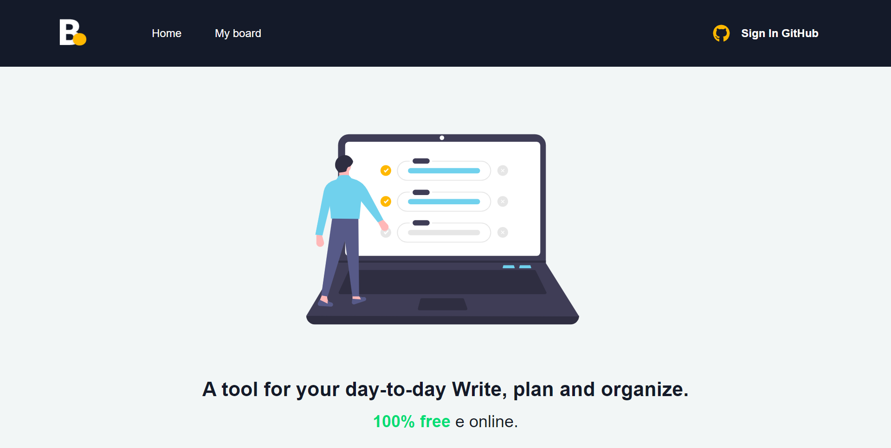
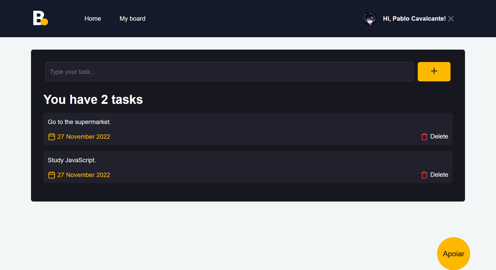
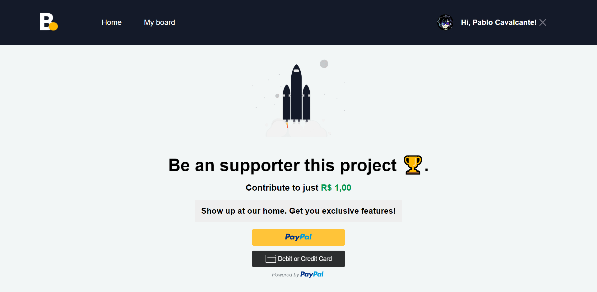

## About
Board is a simple task management project has built with the Nextjs framework.

<p align="center">
  
</p>

  <hr />
<p align="center">
  
</p>
    <hr />
 <p align="center">
  
 </p>

You can see the application running in production at the following address:

```
https://myboard.herokuapp.com/
```

## Getting Started

First, install the dependencies:

```bash
npm install
```

Second, create a .env.local file in the project root and set the following variables:

```bash

# GITHUB
GITHUB_ID
GITHUB_SECRET
NEXTAUTH_URL
NEXTAUTH_SECRET

# FIREBASE
NEXT_PUBLIC_API_KEY
NEXT_PUBLIC_AUTH_DOMAIN
NEXT_PUBLIC_PROJECT_ID
NEXT_PUBLIC_STORAGE_BUCKET
NEXT_PUBLIC_MESSAGING_SENDER_ID
NEXT_PUBLIC_APP_ID

#PAYPAL
NEXT_PUBLIC_PAYPAL_CLIENT_ID
```

Third, run the command:

```bash
npm run dev
```

Open [http://localhost:3000](http://localhost:3000) with your browser to see the result.

You can start editing the page by modifying `pages/index.tsx`. The page auto-updates as you edit the file.

The `pages/api` directory is mapped to `/api/*`. Files in this directory are treated as [API routes](https://nextjs.org/docs/api-routes/introduction) instead of React pages.

## Learn More

To learn more about Next.js, take a look at the following resources:

- [Next.js Documentation](https://nextjs.org/docs) - learn about Next.js features and API.
- [Learn Next.js](https://nextjs.org/learn) - an interactive Next.js tutorial.


